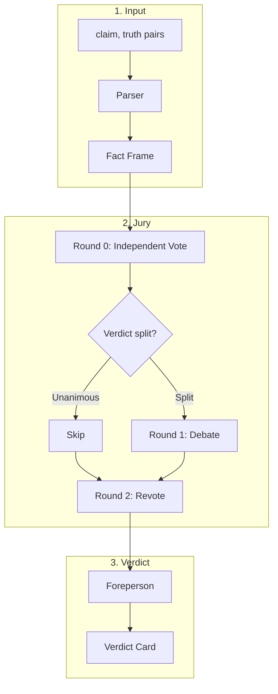

# FactTrace Agentic Jury

A multi-agent jury system for the [FactTrace Hackathon](https://github.com/FactTrace-Ltd/cambridge-dis-hackathon/tree/main) at University of Cambridge. Given `(claim, truth)` pairs, agents debate whether the claim faithfully represents the truth or is a mutation, then produce a transparent verdict.

---

## Overview

**Flow:** Parse → Vote → Debate (if split) → Revote → Foreperson → Verdict

The system anchors debate on a structured **Fact Frame**, runs agents through a **configurable jury**, and uses a **binary rubric** for the final verdict. No black box — agents disagree, argue, and negotiate.

---

## Architecture



---

## Configuration

The system is **config-driven** for scalability. Key configurable elements:

| Component | Config key | Description |
|-----------|------------|-------------|
| **Data source** | `data.source`, `data.claim_col`, `data.truth_col` | Path to CSV, column names |
| **Pairs to process** | `data.pair_ids` | Which pairs to run (manual selection) |
| **Agents** | `agents` | List of agent definitions (name, role) |
| **Fact Frame** | `fact_frame.fields` | Parser output fields (default: entities, quantities, scope, modality, relationship_type, caveats) |
| **Foreperson** | `foreperson.rubric`, `foreperson.dissent_threshold` | Rubric axes (axis + question), min minority for "strong dissent" |
| **Debate** | `debate.max_rounds` | Max debate rounds (default: 2) |
| **Models** | `models.parser`, `models.agents`, `models.foreperson` | Model IDs per component (default: gpt-4o-mini) |

Example config:

```yaml
data:
  source: "data/Nova.csv"
  claim_col: "claim"
  truth_col: "truth"
  pair_ids: [0, 5, 9, 10, 13]

agents:
  - name: literal
    role: "Literal Fact-Checker"
  - name: context
    role: "Context Guardian"
  - name: steelman
    role: "Steelman Advocate"
  - name: sceptic
    role: "Sceptic"

foreperson:
  rubric:
    - axis: numeric_fidelity
      question: "Are all numbers, units, and percentages in the claim supported by the truth?"
    - axis: scope_fidelity
      question: "Are who/where/when correctly represented?"
    - axis: causal_fidelity
      question: "Does the claim avoid causal leaps not supported by the truth?"
    - axis: certainty_fidelity
      question: "Are hedges and certainty preserved?"
    - axis: context_sufficiency
      question: "Are key caveats, qualifiers, or denominators reflected or not contradicted?"
  dissent_threshold: 2  # min agents on minority for "strong dissent"

debate:
  max_rounds: 2

models:
  parser: "gpt-4o-mini"
  agents: "gpt-4o-mini"
  foreperson: "gpt-4o-mini"
```

---

## Data

- **Input:** `(claim, truth)` pairs. Source and column names are configurable.
- **Task:** Determine if the claim faithfully represents the truth or is a mutation.
- **Selection:** Pairs are specified via config (e.g. `pair_ids`); no automated selector.

---

## Fact Frame

A Parser converts `(claim, truth)` into structured output. All agents receive this to ground debate.

| Field | Description |
|-------|-------------|
| **entities** | Who/what is referenced (people, organizations, concepts) |
| **quantities** | Numbers, units, percentages, denominators (from both claim and truth) |
| **scope** | Region, group, timeframe, population (who/where/when it applies to) |
| **modality** | Certainty level (may, likely, caused, proved, approximately) |
| **relationship_type** | Correlation vs causation vs description |
| **caveats** | Limitations, assumptions, qualifiers, conditions |

**Parser output schema:**
```json
{
  "entities": ["entity1", "entity2"],
  "quantities": [{"value": "...", "unit": "...", "in_claim": true, "in_truth": true}],
  "scope": {"region": "...", "group": "...", "timeframe": "..."},
  "modality": "may|likely|caused|proved|approximately|other",
  "relationship_type": "correlation|causation|description",
  "caveats": ["caveat1", "caveat2"]
}
```

---

## Agents

| Dimension | Agent | Question |
|-----------|-------|----------|
| **Precision** | Literal | Do numbers, dates, and explicit statements match? |
| **Meaning** | Context | Is important nuance preserved, or is something misleadingly omitted or shifted? |
| **Advocate** | Steelman | What's the best interpretation of the claim? |
| **Challenger** | Sceptic | What's the worst interpretation? Where could it mislead? |

Literal and Context are specialists; Steelman and Sceptic drive debate on borderline cases.

---

## Protocol

### Round 0 — Independent Vote

- **Input:** `claim`, `truth`, `fact_frame` (per agent)
- **Execution:** All agents run in parallel; no cross-talk
- **Output:** `verdict` (Faithful/Mutated), `confidence`, `key_evidence`, `reasoning`

Agent output schema (minimal structure; no fixed taxonomy):
```json
{
  "verdict": "Faithful|Mutated",
  "confidence": 0.0,
  "key_evidence": [
    {"field": "quantities|scope|...", "claim_says": "...", "truth_says": "...", "issue": "..."}
  ],
  "reasoning": "Free-form explanation"
}
```

### Round 1 — Debate (only if verdict split)

**When:** At least one Faithful and one Mutated. Otherwise skip to Round 2.

**Flow (rule-based, no Moderator):**
1. **Constructives:** Mutated side presents → Faithful side presents
2. **Rebuttals:** Mutated rebuts → Faithful rebuts
3. **Check:** Run LLM checker: "Did the last round add substantive new reasoning? Yes/No"
4. If No → stop. If Yes and rounds < max → repeat from step 2. Else stop.

**Stopping conditions:**
- **No new arguments:** LLM checker returns No
- **Max rounds:** Reached `debate.max_rounds`
- (Consensus is detected at Revote; no mid-debate poll)

**Who speaks:** Agents are assigned to sides by their Round 0 verdict. Each side designates speakers (e.g. one per side per round, or all on that side contribute).

### Round 2 — Revote

- **Input:** Debate transcript (empty if skipped), Round 0 outputs
- **Execution:** All agents run in parallel
- **Output:** Updated `verdict`, `confidence`

### Foreperson

- **Input:** Fact Frame, debate transcript, Round 2 outputs
- **Process:** Answers 5 binary questions (Yes/No), applies aggregation rules
- **Output:** Verdict (Faithful/Mutated/Ambiguous), confidence, reasoning, minimal_edit (if Mutated), dissent_note (if any)

**Verdict rubric (5 axes, each Yes/No):**

| Axis | Question |
|------|----------|
| **numeric_fidelity** | Are all numbers, units, and percentages in the claim supported by the truth? |
| **scope_fidelity** | Are who/where/when (entities, region, timeframe) correctly represented? |
| **causal_fidelity** | Does the claim avoid causal leaps (X caused Y) not supported by the truth? |
| **certainty_fidelity** | Are hedges and certainty preserved? (e.g. "may" not turned into "proves") |
| **context_sufficiency** | Are key caveats, qualifiers, or denominators reflected or at least not contradicted? |

**Aggregation:**
- **Faithful:** All 5 = Yes
- **Ambiguous:** 3–4 Yes AND strong dissent (2+ agents on minority verdict)
- **Mutated:** Otherwise

Agents output free-form reasoning; the system does not use a fixed mutation taxonomy (e.g., the one manually defined in [docs/DATASET_ANALYSIS.md](docs/DATASET_ANALYSIS.md) for Nova.csv).

---

## Project Structure

```
hacktrace-nova/
├── main.py
├── config.yaml                 # or config/
├── agents/
│   ├── __init__.py
│   ├── base.py                 # Base agent interface
│   ├── parser.py
│   ├── literal.py
│   ├── context_guardian.py
│   ├── steelman.py
│   ├── sceptic.py
│   └── foreperson.py
├── workflow/
│   ├── __init__.py
│   ├── pipeline.py             # Main orchestration
│   ├── debate.py               # Debate loop
│   └── state.py
├── schemas/
│   ├── __init__.py
│   ├── fact_frame.py
│   ├── agent_output.py
│   └── verdict.py
├── data/
│   ├── __init__.py
│   └── loader.py
├── prompts/                    # Per-agent prompts (configurable paths)
│   ├── literal.md
│   ├── context.md
│   └── ...
├── docs/
│   └── DATASET_ANALYSIS.md
└── hacktrace-cam/
    └── Nova.csv
```

---

## Setup

```bash
uv sync
cp .env.example .env
```

Edit `.env` and add your OpenAI API key:

```
OPENAI_API_KEY=sk-your-key-here
```

---

## Usage

From the project root:

```bash
uv run python src/main.py
```

This runs the full jury pipeline on the claim/truth pairs defined in `config.yaml` (`data.pair_ids`). Each pair goes through: Parse → Initial vote → Debate (if split) → Revote → Foreperson → Verdict.

**Cost control:** Configure model IDs per component in `config.yaml` (e.g. `gpt-4o-mini` for dev, `gpt-4o` for production).

---

## Dependencies

- langchain
- langchain-openai
- langgraph (optional, for orchestration)

---

## License

See [hacktrace-cam/LICENSE](hacktrace-cam/LICENSE).
