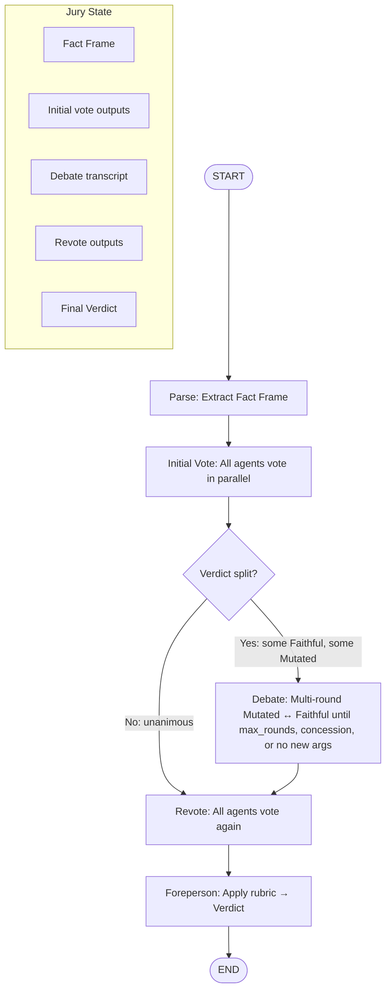

# FactTrace Agentic Jury

A multi-agent jury system for the [FactTrace Hackathon](https://github.com/FactTrace-Ltd/cambridge-dis-hackathon/tree/main) at University of Cambridge. Given `(claim, truth)` pairs, agents debate whether the claim faithfully represents the truth or is a mutation, then produce a transparent verdict.

---

## Overview

**Flow:** Parse → Initial vote → Debate (if split) → Revote → Foreperson → Verdict

The system anchors debate on a structured **Fact Frame**, runs agents through a **configurable jury**, and uses a **binary rubric** for the final verdict. Built with LangGraph for orchestration.

---

## Quick start

```bash
# 1. Install dependencies
uv sync

# 2. Configure API key
cp .env.example .env
# Edit .env and set OPENAI_API_KEY=sk-your-key

# 3. Run
uv run python src/main.py
```

---

## Configuration

Edit `config.yaml` in the project root:

| Key | Description |
|-----|-------------|
| `interactive` | `true` = stream parse, votes, debate, verdict to CLI; `false` = quiet, only final verdict |
| `data.source` | Path to CSV (relative to project root) |
| `data.claim_col`, `data.truth_col` | Column names for claim and truth |
| `data.pair_ids` | 0-indexed row IDs to process (e.g. `[0, 5, 9, 10, 13]`) |
| `agents` | List of `{name, role}` for jury agents |
| `foreperson.rubric` | List of `{axis, question}` for binary rubric |
| `debate.max_rounds` | Max back-and-forth rounds; debate also stops early on concession or no new arguments |
| `models.parser`, `models.agents`, `models.foreperson` | Model IDs per component |
| `elevenlabs.enabled` | `true` = speak each phase aloud via ElevenLabs TTS |
| `elevenlabs.voices` | Voice IDs per role: narrator, literal, context, steelman, sceptic, foreperson |

**ElevenLabs TTS** (optional): When enabled and `ELEVENLABS_API_KEY` is set, the pipeline speaks aloud:
1. Narrator presents the claim and truth
2. Narrator reads the extracted facts
3. Each jury agent speaks their vote and reasoning (distinct voices)
4. Debate speakers present their arguments
5. Foreperson explains the rubric, verdict, and summary

Example:

```yaml
interactive: true

data:
  source: "data/Nova.csv"
  claim_col: "claim"
  truth_col: "truth"
  pair_ids: [0, 5, 9, 10, 13]

agents:
  - name: literal
    role: "Literal Fact-Checker"
  - name: context
    role: "Context Guardian"
  - name: steelman
    role: "Steelman Advocate"
  - name: sceptic
    role: "Sceptic"

foreperson:
  rubric:
    - axis: numeric_fidelity
      question: "Are all numbers, units, and percentages in the claim supported by the truth?"
    - axis: scope_fidelity
      question: "Are who/where/when correctly represented?"
    - axis: causal_fidelity
      question: "Does the claim avoid causal leaps not supported by the truth?"
    - axis: certainty_fidelity
      question: "Are hedges and certainty preserved?"
    - axis: context_sufficiency
      question: "Are key caveats, qualifiers, or denominators reflected or not contradicted?"
  dissent_threshold: 2

debate:
  max_rounds: 2

models:
  parser: "gpt-4.1-mini"
  agents: "gpt-4.1-mini"
  foreperson: "gpt-4.1-mini"

# Optional: ElevenLabs TTS
elevenlabs:
  enabled: false
  model_id: "eleven_multilingual_v2"
  voices:
    narrator: "EXAVITQu4vr4xnSDxMaL"
    literal: "pNInz6obpgDQGcFmaJgB"
    context: "TxGEqnHWrfWFTfGW9XjX"
    steelman: "ErXwobaYiN019PkySvjV"
    sceptic: "GBv7mTt0atIp3Br8iCZE"
    foreperson: "IKne3meq5aSn9XLyUdCD"
```

---

## Architecture

### Flow diagram



### Phase-by-phase analysis

#### Phase 1: Parse

**Goal:** Convert the raw `(claim, truth)` pair into a structured **Fact Frame** that grounds all subsequent debate.

**Process:**
- A single LLM call (parser agent) receives claim and truth
- Extracts key facts as a list of `Fact` objects: `category`, `claim_says`, `truth_says`, `note`
- Categories are free-form (e.g. numeric, entity, temporal, causal, certainty)
- Each fact compares what the claim states vs what the truth states; `note` flags mismatches, omissions, or additions

**Output:** `FactFrame` (list of facts). All jury agents receive this—no agent sees raw claim/truth alone for their vote; debate is anchored on shared structured facts.

**Config:** `models.parser`

---

#### Phase 2: Initial Vote

**Goal:** Each jury agent independently decides Faithful or Mutated, with no cross-talk.

**Process:**
- All agents run in **parallel** via LangChain `RunnableParallel`
- Each agent gets: role instruction, claim, truth, fact frame
- Agents use `vote_template.txt` + role-specific prompt (`literal.txt`, `context.txt`, etc.)
- Structured output: `verdict` (Faithful/Mutated), `confidence`, `evidence`, `reasoning`

**Output:** List of `(agent_name, JuryOutput)`. Used to detect split and, if no debate, passed directly to Foreperson via revote path.

**Agents:**
| Agent | Focus |
|-------|-------|
| literal | Numbers, dates, explicit statements—do they match? |
| context | Nuance, caveats, qualifiers—is important context preserved? |
| steelman | Best interpretation of the claim—charitable reading |
| sceptic | Worst interpretation—where could it mislead? |

**Config:** `agents`, `models.agents`

---

#### Phase 3: Debate (conditional)

**Goal:** When verdict is split, agents argue to surface key disagreements before revote.

**When it runs:** Only if at least one agent voted Faithful and at least one Mutated. If unanimous, skip to Revote.

**Process:**
- Agents are split into two sides by their initial verdict (Mutated vs Faithful)
- **Multi-round:** Mutated speaks, Faithful responds, Mutated rebuts, Faithful rebuts, … up to `max_rounds`
- Debate uses `debate_template.txt`; status checks use `debate_status_check.txt`
- Speakers rotate within each side (e.g. round 0: literal, round 1: context); each sees full transcript and responds
- **Early termination:** max rounds, concession, or no new arguments (LLM check)
- Output is a **transcript** of `{speaker, content, side}` entries

**Output:** Transcript appended to state. Revote agents receive this transcript and “Consider the arguments above before voting.”

**Config:** `debate.max_rounds`

---

#### Phase 4: Revote

**Goal:** All agents vote again, optionally informed by the debate transcript.

**Process:**
- Same mechanism as Initial Vote (`run_vote`) but with optional `transcript`
- If debate ran: transcript is injected into the prompt; agents see the exchange before voting
- If debate was skipped: `transcript` is empty; agents vote again on the same fact frame (effectively a second independent vote, though typically unanimous cases need no revote—current flow runs revote in both paths for consistency)

**Output:** List of `(agent_name, JuryOutput)`. This is the final jury stance passed to the Foreperson.

**Config:** Same as Initial Vote

---

#### Phase 5: Foreperson

**Goal:** Apply a config-driven binary rubric and produce the final Verdict.

**Process:**
- Receives: claim, truth, fact frame, debate transcript, revote outputs
- Rubric axes from config (e.g. numeric_fidelity, scope_fidelity, causal_fidelity, certainty_fidelity, context_sufficiency)
- For each axis: Yes/No (passed/failed) plus optional note
- Aggregation:
  - **Faithful:** All axes passed
  - **Mutated:** At least one axis failed
  - **Ambiguous:** Edge case with significant dissent
- Optional: `minimal_edit` (if Mutated), `dissent_note` (if ≥ `dissent_threshold` agents on minority)

**Output:** `Verdict` with `verdict`, `confidence`, `axis_results`, `summary`, `minimal_edit`, `dissent_note`

**Config:** `foreperson.rubric`, `foreperson.dissent_threshold`, `models.foreperson`

---

## Project structure

```
hacktrace-nova/
├── config.yaml              # Data, agents, rubric, models, interactive flag
├── .env.example             # Copy to .env, set OPENAI_API_KEY
├── pyproject.toml
├── data/                    # CSV datasets (Nova, Atlas, etc.)
│   └── Nova.csv
├── docs/
│   ├── BUILD_PLAN.md
│   ├── DATASET_ANALYSIS.md
│   └── TASK.md
└── src/
    ├── main.py              # Entry point
    ├── config/
    │   └── loader.py        # YAML config loader
    ├── data/
    │   └── loader.py        # CSV pair loader
    ├── schemas/
    │   ├── fact_frame.py    # Fact, FactFrame
    │   ├── jury_output.py   # Evidence, JuryOutput
    │   ├── verdict.py       # AxisResult, Verdict
    │   └── debate_status.py # DebateStatus (conceded, no_new_arguments)
    ├── agents/
    │   ├── parser.py        # Fact Frame extraction
    │   ├── jury.py          # Jury agents (vote + debate)
    │   └── foreperson.py    # Final verdict
    ├── workflow/
    │   ├── graph.py         # LangGraph pipeline (parse→vote→debate→revote→foreperson)
    │   ├── state.py         # JuryState
    │   ├── vote.py          # run_vote, is_split
    │   └── debate.py        # run_debate
    ├── audio/
    │   └── tts.py           # ElevenLabs TTS (speak, is_available)
    └── prompts/
        ├── parser.txt
        ├── foreperson.txt
        └── jury/
        ├── vote_template.txt
        ├── debate_template.txt
        ├── debate_status_check.txt
        ├── literal.txt
            ├── context.txt
            ├── steelman.txt
            └── sceptic.txt
```

---

## Schemas

**FactFrame** (`fact_frame.py`): List of `Fact` with `category`, `claim_says`, `truth_says`, `note`.

**JuryOutput** (`jury_output.py`): `verdict` (Faithful/Mutated), `confidence`, `evidence` (list of Fact+issue), `reasoning`.

**Verdict** (`verdict.py`): `verdict`, `confidence`, `axis_results` (one per rubric axis: axis, passed, note), `summary`, `minimal_edit`, `dissent_note`.

---

## Dependencies

- langchain, langchain-openai
- langgraph
- elevenlabs (for optional TTS)
- PyYAML, pydantic-settings, python-dotenv

---

## License

See [data/LICENSE](data/LICENSE).
